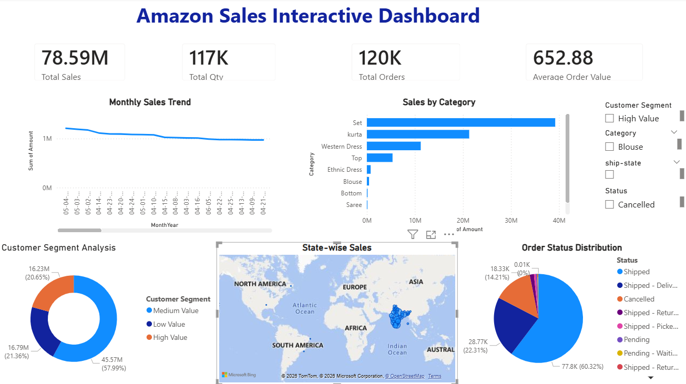
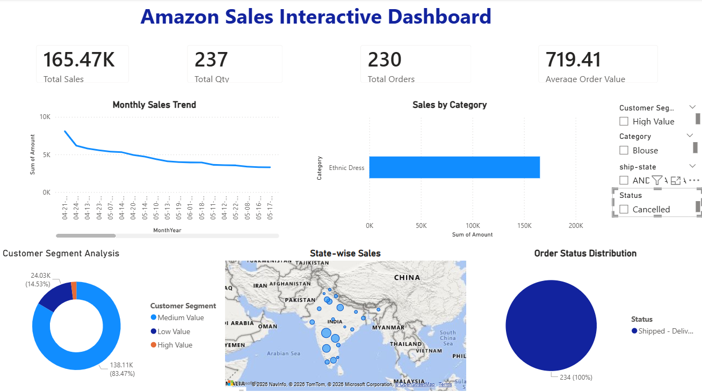
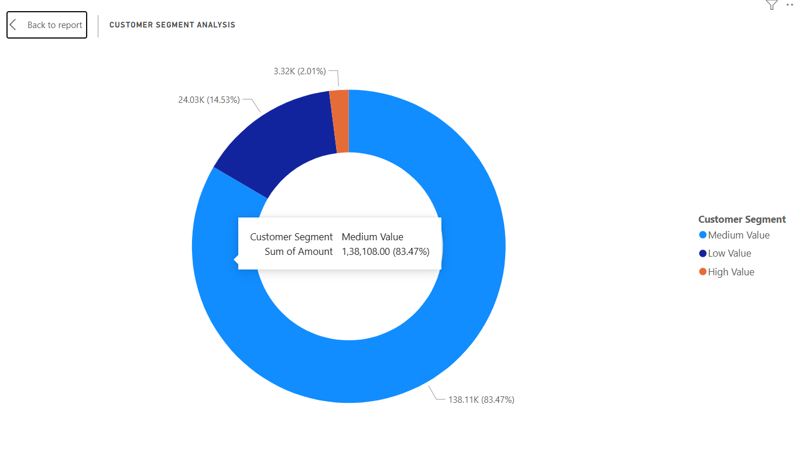

# Amazon Sales Interactive Dashboard & Deep-Dive Analysis

## 📌 Project Overview

This project focuses on performing Deep-Dive Analysis and Interactive Dashboarding on an Amazon Ecommerce Sales Dataset using Python and Power BI.

The objective of this project is to analyze sales performance, identify customer purchasing behavior, generate business insights, and build an interactive dashboard for data-driven decision-making.

The project was completed as part of a Virtual Internship Task - Task 3.

---

# 🎯 Objectives

- Perform Exploratory Data Analysis (EDA)
- Analyze ecommerce sales performance
- Define business KPIs
- Perform customer segmentation analysis
- Build an interactive Power BI dashboard
- Generate actionable business insights

---

# 🛠️ Tools & Technologies Used

- Python
- Pandas
- NumPy
- Matplotlib
- Seaborn
- Jupyter Notebook
- Power BI
- VS Code

---

# 📂 Dataset

Dataset Used: Amazon Ecommerce Sales Dataset

The dataset contains:

- Order Information
- Product Details
- Category Information
- Customer Shipping Details
- Sales Amount
- Quantity Sold
- Order Status
- Fulfillment Information

---

# 📊 Key Performance Indicators (KPIs)

The dashboard includes the following KPIs:

- Total Sales
- Total Orders
- Total Quantity Sold
- Average Order Value
- Category-wise Sales
- Customer Segment Contribution

---

# 📈 Dashboard Features

## ✅ KPI Cards

Displays important business performance metrics including sales, orders, and average order value.

## ✅ Monthly Sales Trend

Analyzes sales performance trends over time.

## ✅ Category-wise Sales Analysis

Identifies top-performing product categories based on revenue.

## ✅ State-wise Sales Analysis

Visualizes regional sales distribution using map visualization.

## ✅ Order Status Distribution

Analyzes shipped, cancelled, pending, and returned orders.

## ✅ Customer Segmentation Analysis

Customers are segmented into:

- High Value
- Medium Value
- Low Value

based on purchase amount.

## ✅ Interactive Filters / Slicers

Allows dynamic filtering using:

- Customer Segment
- Product Category
- Order Status
- Ship State

---

# 🔍 Analysis Performed

## 📌 Exploratory Data Analysis (EDA)

- Data cleaning
- Data preprocessing
- Data type handling
- Missing value analysis
- Descriptive statistics

## 📌 Business Analysis

- Sales trend analysis
- Category performance analysis
- Regional sales analysis
- Order status analysis

## 📌 Customer Segmentation

Implemented rule-based customer segmentation using Python and Power BI DAX formulas.

---

# 📈 Key Insights

- Sets and Kurtas generated the highest sales revenue.
- Medium-value customers contributed the majority of revenue.
- Most orders were successfully shipped.
- Sales were concentrated in specific states.
- Interactive filtering improved business data exploration.

---

# 📸 Dashboard Screenshots

## Main Dashboard



## Filtered Dashboard



## Customer Segmentation



---

# 📂 Project Structure

```bash
task-3-interactive-dashboard/
│
├── dataset/
├── code/
├── dashboard/
├── screenshots/
├── report/
└── README.md
```

---

# 🚀 How to Run the Project

## 1️⃣ Install Dependencies

```bash
pip install pandas numpy matplotlib seaborn notebook
```

## 2️⃣ Run Jupyter Notebook

```bash
jupyter notebook
```

Open:

```bash
analysis.ipynb
```

---

# 📚 Learning Outcomes

Through this project, I improved my skills in:

- Data Analysis
- Data Cleaning
- Data Visualization
- Business Intelligence
- Dashboard Development
- KPI Analysis
- Customer Segmentation
- Interactive Reporting

---

# 📌 Conclusion

This project demonstrates how data analytics and dashboarding can help businesses monitor sales performance, understand customer behavior, and make data-driven decisions effectively using Python and Power BI.